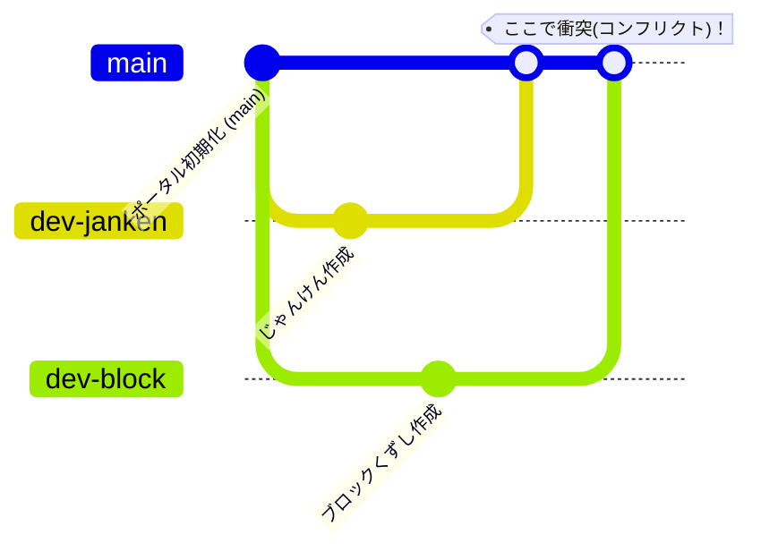

# 04. 【チーム】Gitで合体＆コンフリクト体験

ここまで、2つのゲーム（じゃんけん・ブロックくずし）を別々に作成しました。
いよいよ、2つのプログラムを1つに合体（マージ）させます！
そして、チーム開発で避けては通れない「プログラムの衝突（コンフリクト）」の解決に挑戦しましょう。

---

## 🗺️ 1. Git開発の流れ（イメージ図）

通常、チーム開発では本番用のコード（`main` ブランチ）を直接いじらず、自分の作業用に「枝（ブランチ）」を分けて開発します。



1. **枝分かれ**: お互いに `main` ブランチから自分の作業用ブランチ（`dev-janken` や `dev-block`）を作ります。
2. **合体（マージ）**: 最初にじゃんけんブランチを合体させたときはスムーズに行きますが、次にブロックくずしブランチを合体させるときに、同じファイルを編集していると「衝突（コンフリクト）」が発生します。

---

## 🤝 2. それぞれ作業用ブランチを作って開発する

お互いのPCで、以下のコマンドを使って別々のブランチを作成し、ゲームを作った状態にします。

### 💻 じゃんけん担当者のブランチ作成
```bash
git checkout -b dev-janken
# 作業が終わったらコミット
git add .
git commit -m "じゃんけんゲームを追加"
```

### 💻 ブロックくずし担当者のブランチ作成
```bash
git checkout -b dev-block
# 作業が終わったらコミット
git add .
git commit -m "ブロックくずしを移植"
```

---

## 💥 3. コンフリクト（衝突）を発生させてみよう！

両方のブランチで、共通のファイルである `main.js` や `index.html` にゲームのインポート設定やボタンなどを書き加えました。
これを1つの `main` ブランチに合体させると、Gitが**「どっちの変更を優先すればいいか分からない！」**と怒ります。

### 実験の手順
1. **じゃんけん担当者**が先に `main` にブランチを合体（マージ）します。これはすんなり成功します。
2. その後、**ブロックくずし担当者**が `main` に自分のブランチを合体しようとします。
3. すると、ターミナルに以下のようなメッセージが表示され、合体が一時停止します。
   ```text
   CONFLICT (content): Merge conflict in main.js
   Automatic merge failed; fix conflicts and then commit the result.
   ```

---

## 🛠️ 4. コンフリクトを解決しよう！

コンフリクトが発生したファイル（例: `main.js`）を開くと、Gitが自動で挿入した変な記号（コンフリクトマーカー）が表示されています。

### 🔍 競合した状態のコード例 (`main.js`)
```javascript
import './style.css';
<<<<<<< HEAD
import './janken.rb';
=======
import './block.js';
>>>>>>> dev-block
```
* **`<<<<<<< HEAD` から `=======` まで**: 現在の `main` ブランチ（先に合体されたじゃんけん側）の変更です。
* **`=======` から `>>>>>>> dev-block` まで**: 合体しようとしている `dev-block` ブランチの変更です。

### 💡 直し方
今回の目的は**「両方のゲームをポータルに載せること」**です。したがって、両方のコードを残すように記号をすべて消して以下のように修正します。

```javascript
import './style.css';
import './janken.rb';
import './block.js';
```

修正して保存したら、ターミナルで以下のコマンドを実行し、「競合を直したよ！」とGitに伝えてマージを完了させます。

```bash
git add main.js
git commit -m "じゃんけんとブロックくずしの競合を解決してマージ"
```

これで、2人の書いたプログラムが無事に1つに合体しました！

---

## ✅ チェックポイント
* [ ] 2人の作成したゲーム（じゃんけん・ブロックくずし）の両方が1つの画面で選べるようになりましたか？
* [ ] 競合マーカー（`<<<<<<<` や `=======`）がファイル内に残っていませんか？

---
[次へ：まるばつゲームを作ろう](./05_marubatsu_ruby.md)
